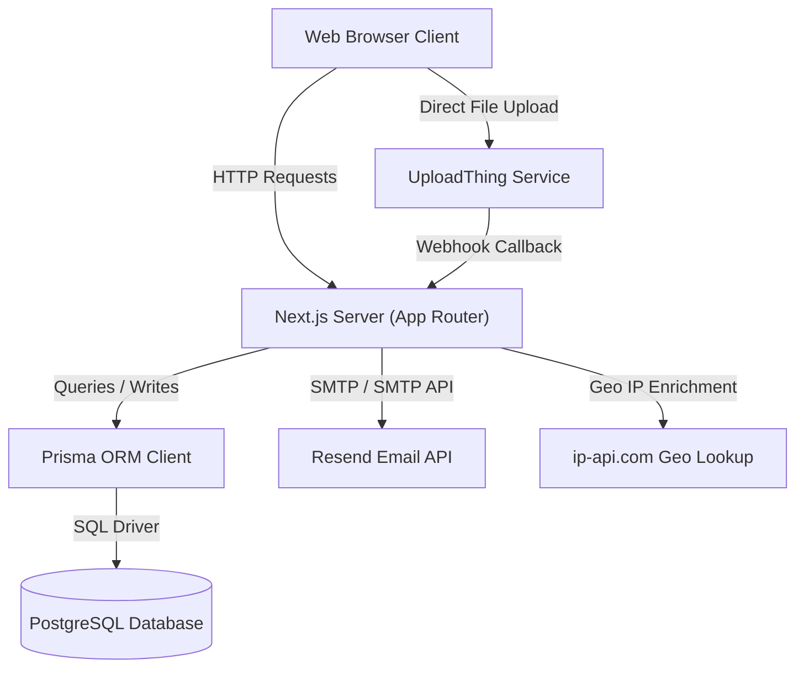
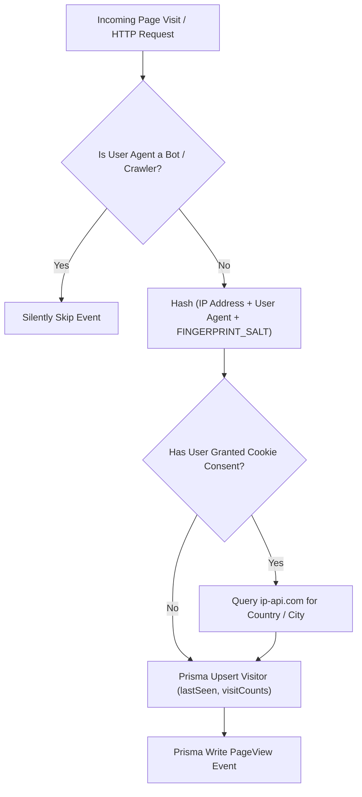

# ARCHITECTURE.md - System Design & Core Flows

This document details the high-level architecture, database schemas, and data pipelines for the portfolio codebase, targeting developers wishing to understand the system mechanics.

---

## 1. System Overview

The application is built on **Next.js** using the **App Router** paradigm, connecting to a **PostgreSQL** database managed via the **Prisma ORM**. It handles image uploads through **UploadThing**, dispatches transactional emails using **Resend**, and houses a fully custom visitor analytics and fingerprinting engine.

---

## 2. Core Flows

### A. Admin Authentication & Session Management
NextAuth v5 manages administration access. Custom logic ensures database-level tracking of active logins to facilitate session auditing and revocation.

```mermaid
sequenceDiagram
    autonumber
    actor Admin as Admin Browser
    participant NextJS as NextAuth Middleware
    participant Db as PostgreSQL (Prisma)

    Admin->>NextJS: Login Request (Email, Password, OTP Code)
    NextJS->>Db: Query User Details (AdminUser)
    Db-->>NextJS: AdminUser Row
    NextJS->>NextJS: Verify password hash & 2FA TOTP code
    
    rect rgb(20, 20, 20)
        Note over NextJS, Db: Create database-tracked Session
        NextJS->>Db: Create AdminSession (Token, IP, Browser)
        Db-->>NextJS: AdminSession created successfully
    end
    
    NextJS-->>Admin: Set JWT Token in Cookies
    
    Admin->>NextJS: Visit Protected Route (/admin/*)
    NextJS->>Db: Query active Session status
    Db-->>NextJS: Session is active (true)
    NextJS-->>Admin: Render requested route
```

---

### B. File Upload Flow (UploadThing Integration)
Images uploaded inside the photography dashboard or blog editor bypass Next.js servers and go directly to UploadThing storage. A secure backend callback maps it into database tables.

```mermaid
sequenceDiagram
    autonumber
    actor Client as Browser Editor
    participant UT as UploadThing Storage
    participant Server as Next.js Callback Api
    participant Db as PostgreSQL

    Client->>Server: Request upload authorization ticket
    Server-->>Client: Return signed ticket & endpoint token
    Client->>UT: POST Image data with authorization token
    UT-->>Client: Returns file URL and file ID keys
    
    rect rgb(20, 20, 20)
        Note over UT, Server: Asynchronous Callback Sync
        UT->>Server: POST callback webhook (file metadata)
        Server->>Db: Upsert Photo record or update post coverImage fields
        Db-->>Server: Database record updated
        Server-->>UT: HTTP 200 OK
    end
```

---

### C. Visitor Analytics & Fingerprinting Pipeline
The self-hosted visitor telemetry does not rely on third-party scripts. Rather, it computes visitor fingerprints using browser contexts hashed with a secure environmental salt.

---

## 3. Database Entity Relationship Diagram (ERD)

The PostgreSQL database is organized into the following relational model represented in Prisma:

```mermaid
erDiagram
    AdminUser ||--o{ AdminSession : owns
    Post ||--o{ ShortLink : references
    Post ||--o{ PostEngagementConfig : configures
    Post ||--o{ PostEmojiReaction : receives
    Post ||--o{ PostHelpfulVote : receives
    Post ||--o{ PostStarRating : receives
    Post ||--o{ PostSectionReaction : receives
    Post ||--o{ PostEndSurveyResponse : receives
    Post ||--o{ PostNotifyRequest : logs
    Post ||--o{ PostAnalyticsEvent : registers
    Post ||--o{ EmailCampaign : targets
    Project ||--o{ ShortLink : references
    Visitor ||--o{ PageView : tracks
    Visitor ||--o{ ContactMessage : sends
    Visitor ||--o{ ShortLinkClick : clicks
    Visitor ||--o{ CodeCopyEvent : copies
    Photo ||--o{ PhotoInteraction : receives
    ShortLink ||--o{ ShortLinkClick : receives
    EmailCampaign ||--o{ EmailOpen : registers
    WorkspacePage ||--o{ WorkspacePage : parent_child
    WorkspacePage ||--o{ WorkspaceTask : details
    WorkspacePage ||--o{ WorkspaceBookmark : details
    DashboardProject ||--o{ DashboardMilestone : groups
    DashboardProject ||--o{ DashboardTask : organizes
    DashboardMilestone ||--o{ DashboardTask : schedules

    AdminUser {
        string id PK
        string email
        string passwordHash
        string twoFactorSecret
        boolean twoFactorEnabled
        string resetToken
        datetime resetTokenExpiry
        boolean hasSeenAdminTour
        json seenPageTours
        datetime createdAt
        datetime updatedAt
    }

    AdminSession {
        string id PK
        string userId FK
        string token
        string ipAddress
        string userAgent
        string deviceType
        string browser
        string os
        string country
        string city
        boolean active
        datetime lastUsedAt
        datetime createdAt
    }

    Post {
        string id PK
        string title
        string subtitle
        string slug
        string excerpt
        string content
        string coverImage
        string tags
        boolean published
        int views
        datetime createdAt
        datetime updatedAt
    }

    Project {
        string id PK
        string title
        string slug
        string description
        string longDesc
        string techStack
        string liveUrl
        string githubUrl
        string coverImage
        boolean featured
        int order
        string resumeBullets
        datetime createdAt
    }

    Skill {
        string id PK
        string name
        string icon
        int level
        string category
        int order
    }

    Experience {
        string id PK
        string role
        string company
        string location
        datetime startDate
        datetime endDate
        boolean current
        string description
        int order
    }

    ContactMessage {
        string id PK
        string name
        string email
        string subject
        string message
        boolean read
        boolean isAdminReply
        datetime createdAt
        string visitorId FK
    }

    SiteSettings {
        string id PK
        string key
        string value
    }

    Visitor {
        string id PK
        string fingerprint
        string country
        string city
        string device
        string browser
        string os
        datetime firstSeen
        datetime lastSeen
        int visits
        string consentType
    }

    PageView {
        string id PK
        string visitorId FK
        string path
        string referrer
        int duration
        datetime timestamp
        string utmSource
        string utmMedium
        string utmCampaign
        string utmContent
        string utmTerm
        string trafficSource
    }

    ResumeSettings {
        string id PK
        string key
        string value
    }

    Education {
        string id PK
        string degree
        string institution
        string field
        string startYear
        string endYear
        boolean current
        string description
        int order
        datetime createdAt
    }

    Certification {
        string id PK
        string name
        string issuer
        string year
        string url
        int order
        datetime createdAt
    }

    ResumeDownload {
        string id PK
        string visitorIp
        string country
        string city
        string region
        string timezone
        string isp
        float lat
        float lng
        string userAgent
        string deviceType
        string deviceVendor
        string deviceModel
        string browserName
        string browserVersion
        string osName
        string osVersion
        string cpuArch
        datetime downloadedAt
        datetime verifiedAt
        int verifyCount
    }

    Photo {
        string id PK
        string title
        string description
        string imageUrl
        int order
        boolean visible
        json exif_data
        int likes
        int downloads
        int shares
        datetime createdAt
    }

    PhotoInteraction {
        string id PK
        string photoId FK
        string visitorId
        string type
        datetime createdAt
    }

    ShortLink {
        string id PK
        string code
        string targetUrl
        string type
        string postId FK
        string projectId FK
        datetime createdAt
    }

    ShortLinkClick {
        string id PK
        string shortLinkId FK
        string visitorId FK
        string userAgent
        string referer
        datetime createdAt
    }

    CodeCopyEvent {
        string id PK
        string postId FK
        string codeBlockId
        string codeBlock
        boolean isMultiline
        string visitorId FK
        datetime createdAt
    }

    PostEngagementConfig {
        string id PK
        string postId FK
        boolean emojiReactionsOn
        boolean helpfulVoteOn
        boolean starRatingOn
        boolean sectionReactionsOn
        boolean endSurveyOn
        boolean difficultyToggleOn
        boolean exitIntentOn
        boolean notifyMeOn
        datetime createdAt
        datetime updatedAt
    }

    PostEmojiReaction {
        string id PK
        string postId FK
        string visitorId
        string emoji
        datetime createdAt
    }

    PostHelpfulVote {
        string id PK
        string postId FK
        string visitorId
        boolean helpful
        datetime createdAt
    }

    PostStarRating {
        string id PK
        string postId FK
        string visitorId
        int rating
        datetime createdAt
    }

    PostSectionReaction {
        string id PK
        string postId FK
        string visitorId
        string sectionId
        string emoji
        datetime createdAt
    }

    PostEndSurveyResponse {
        string id PK
        string postId FK
        string visitorId
        string responseText
        string difficulty
        datetime createdAt
    }

    PostNotifyRequest {
        string id PK
        string postId FK
        string email
        string topic
        boolean confirmed
        datetime createdAt
    }

    PostAnalyticsEvent {
        string id PK
        string postId FK
        string visitorId
        string eventType
        string value
        string referrer
        string utmSource
        string utmMedium
        string utmCampaign
        datetime createdAt
    }

    SiteSearchQuery {
        string id PK
        string query
        string visitorId
        int resultsCount
        datetime createdAt
    }

    EmailCampaign {
        string id PK
        string postId FK
        string subject
        int sentCount
        datetime createdAt
    }

    EmailOpen {
        string id PK
        string campaignId FK
        string email
        string userAgent
        datetime openedAt
    }

    DashboardProject {
        string id PK
        string title
        string status
        string description
        datetime dueDate
        datetime createdAt
        datetime updatedAt
    }

    DashboardMilestone {
        string id PK
        string title
        string projectId FK
        datetime dueDate
        string status
        datetime createdAt
    }

    DashboardTask {
        string id PK
        string title
        string projectId FK
        string milestoneId FK
        string type
        string blogId
        string status
        string priority
        datetime dueDate
        datetime createdAt
        datetime updatedAt
    }

    WorkspacePage {
        string id PK
        string title
        string emoji
        string type
        string parentId FK
        json content
        json meta
        int order
        datetime createdAt
        datetime updatedAt
    }

    WorkspaceTask {
        string id PK
        string pageId FK
        string title
        string status
        string priority
        datetime dueDate
        string notes
        int order
        datetime createdAt
        datetime updatedAt
    }

    WorkspaceBookmark {
        string id PK
        string pageId FK
        string url
        string title
        string description
        string category
        string favicon
        string ogImage
        string ogTitle
        string ogDesc
        datetime createdAt
    }
```

